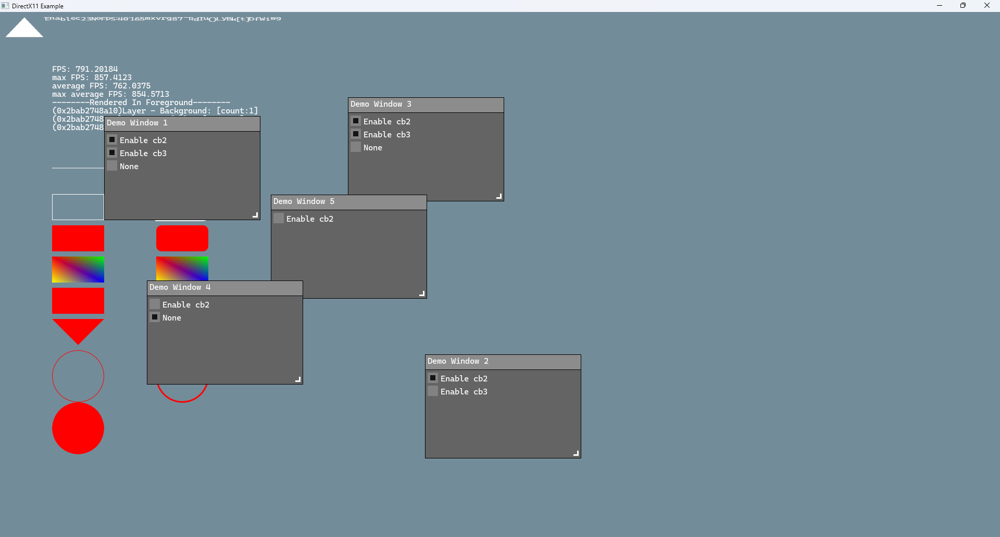

Here is the English version of your README for **ArgonGui**:

# ⚡ ArgonGui

> *A lightweight, cross-platform, untrammeled GUI framework that doesn't ask for much—just your heart.* ❤️

**ArgonGui** is a minimalist and highly flexible GUI framework designed for modern C++17 developers.

[](https://github.com/NaOrganization/ArgonGui/issues)
[](https://github.com/NaOrganization/ArgonGui/forks)
[](https://github.com/NaOrganization/ArgonGui/issues)
[](./LICENSE)
[](https://github.com/NaOrganization/ArgonGui/wiki)

## ✨ Features

- **Robust Layered Architecture** — Clean separation of context and subsystems ensures low coupling and high efficiency.
- **Graphic Element System** — Layered focus and hover management makes UI control straightforward.
- **Component-Free Philosophy** — You're in full control of your widgets. ArgonGui is your tool, not your boss.
- **Cross-Platform Support** — One unified interface across multiple platforms makes porting easy.

## 🌏 Demo



## 📚 Dependencies

Some modules in ArgonGui rely on the following open-source libraries:

- [FreeType](https://freetype.org) — For font parsing and glyph generation (via `ArgonFreeTypeGlyphParser`)
- [fmt](https://github.com/fmtlib/fmt) — A high-performance formatting library (used in `Example\Exe_Dx11_Win32\Main`)

We recommend using  [`vcpkg`](https://github.com/microsoft/vcpkg) to install dependencies:

```
vcpkg install fmt:x64-windows-static
vcpkg install freetype:x64-windows-static
vcpkg install fmt:x86-windows-static
vcpkg install freetype:x86-windows-static
```

## 📦 Installation

Package manager integration (e.g., vcpkg/conan) is not yet available, but you can add ArgonGui directly as a submodule:

```
git submodule add https://github.com/NaOrganization/ArgonGui
```

**Build Requirements:**

- C++17 compatible compiler
- Supported platform: Windows

### ⭐ Star History

[](https://www.star-history.com/#NaOrganization/ArgonGui&Date)

## 🔒 License

ArgonGui is licensed under the Apache License 2.0.

**© 2025 by [NaOrganization](https://github.com/NaOrganization) & All ArgonGui Contributors**