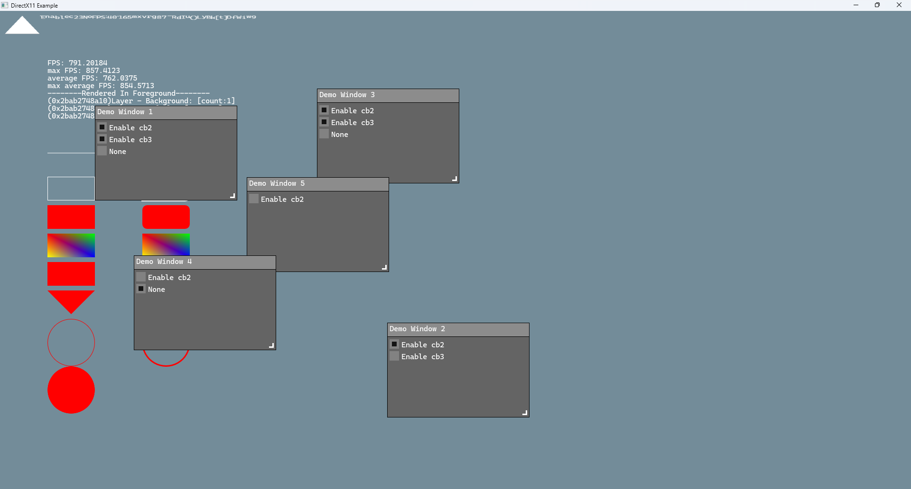

# ⚡ ArgonGui

> *A lightweight, cross-platform, untrammeled GUI framework that doesn't ask for much—just your heart.* ❤️

ArgonGui 是一个为现代 C++17 开发者打造的极简高灵活度 GUI 框架。

[](https://github.com/NaOrganization/ArgonGui/issues)
[](https://github.com/NaOrganization/ArgonGui/forks)
[](https://github.com/NaOrganization/ArgonGui/issues)
[](./LICENSE)
[](https://github.com/NaOrganization/ArgonGui/wiki)
[](./README.en.md)


## ✨ 特性 Features

- **严谨层级架构设计** —— 分为Context和Subsystems，低耦合高效率
- **图形元素系统** —— 层级式聚焦与悬停管理，轻松控制 UI 流程
- **无固定组件** —— 极高自由度DIY属于你的控件，ArgonGui 永远只是你的工具，而不是主角
- **跨平台支持** —— 多平台同一接口，移植更省心

## 🌏 演示 Demo



## 📚 依赖 Dependencies

ArgonGui 部分模块依赖以下开源库：

- [FreeType](https://freetype.org) — 用于字体解析和字形生成 (ArgonFreeTypeGlyphParser)
- [fmt](https://github.com/fmtlib/fmt) — 高性能的格式化字符串库 (Example\Exe_Dx11_Win32\Main)

推荐使用 [`vcpkg`](https://github.com/microsoft/vcpkg) 来安装依赖项：
```bash
vcpkg install fmt:x64-windows-static
vcpkg install freetype:x64-windows-static
vcpkg install fmt:x86-windows-static
vcpkg install freetype:x86-windows-static
```

## 📦 安装 Installation

目前还没有提供包管理集成（比如 vcpkg/conan），但你可以直接将 `ArgonGui` 作为子模块加入项目：

```bash
git submodule add https://github.com/NaOrganization/ArgonGui
```

编译要求：
- C++17 支持
- 支持平台：Windows

### ⭐ Star 历史图 GitHub Profile Trophy

[](https://www.star-history.com/#NaOrganization/ArgonGui&Date)

---

## 🔒 协议 License

ArgonGui is licensed under the [Apache License 2.0](./LICENSE).

**© 2025 by [NaOrganization](https://github.com/NaOrganization) & All ArgonGui Contributors**
